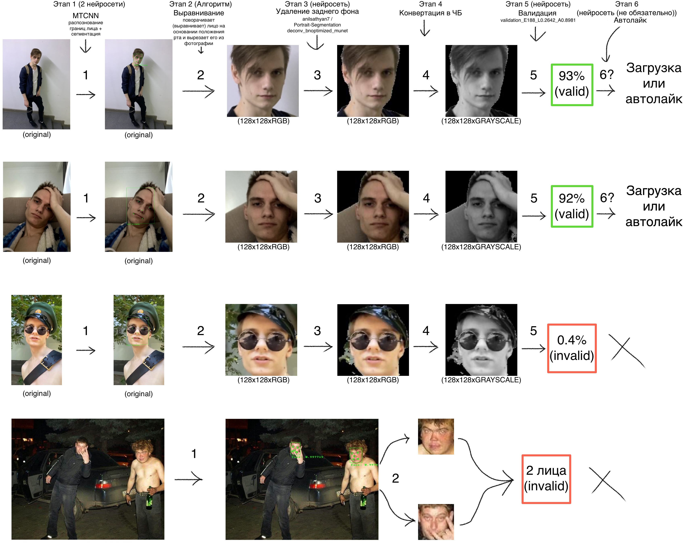

# Tinder Neural Network Like
###### Tinder, I'm sorry.
###### I did this because I was interested in sounding neural networks and the structure of the web.
###### I did this for the purposes of self-education.

# Введение
##### Tinder Neural Network Like (далее - TNNL), в режиме реального времени, полностью автономно, без вашего участия может лайкать или дизлайкать пользователей сети Tinder по вашим интересам при помощи нейросетей (их тут аж 5 штук).
###### То есть не в тупую, а имеено тех пользователей, которые предположительно вам будут интересны.
###### О всех алгоритмах, нюансах и точности работы будет описано ниже.
###### Идея разработки - самообразование. Проект был сложным и невероятно интригующим. ~~*__на самом деле меня кинула девка я плакал слёзами, намертво умирал смертью и устал сидеть в тиндере__*~~
###### Реализовано на: Golang, React, Typescript, Python, Tensorflow, GRPC

# Установка / Запуск
###### Для работы потребуется установленный Python версии 3.9 (простите меня пожалуйста, не я такой, жизнь такая), в интернете куча гайдов как его поставить.
###### Пока только под MacOS, Windows будет позже.
###### 1) Загружаете и распаковываете zip TNNL под вашу ОС
###### 2) Загружаете все зависимости для FaceDetect (Python) открыв скрипт из директории: ./TNNL/facedetect/install_FaceDetect_dependencies.(command/bat)
###### 3) Запускаете сам TNNL: ./TNNL/start_TNNL.(command/bat)
###### 4) Открываете в браузере: localhost:8090 (Откроется автоматически)
###### 5) ??????? 
###### 6) PROFIT!11!1111!!!!
###### to dev
###### ./yarn run build
###### ./yarn run dev
###### ./go run tnn.go
###### ./grpctranport/generate.txt

# Инструкция
### Интерфейс адаптирован под телефон, так что набивать датасет можно где угодно из локальной сети ~~(хоть сидя на унитазе)~~

###### Первым делом после запуска необходимо на вкладке "Настройки" ввести токен от тиндера, [инструкция](/front/TokenTutorial.mp4) как и где его достать доступна по кнопке "Где взять токен?".
###### После чего загрузить профили по которым будете обучать нейросеть под себя на вкладке "Загрузка" (не волнуйтесь, 4 нейронки все сделют за вас, отсеят нужные от ненужных).
###### После загрузки на вкладке "Обучение нейронной сети" свайпаем пользователей как в тиндере (предсказание в режиме реального времени начинает работать только после обучения, его можно сделать и предварительно), насвайпать желательно как минимум 10 000 фотографий в обе категории (т.е 20 000), не пугайтесь, свайпаете вы не фотографии, а ПОЛЬЗОВАТЕЛЕЙ, по этому реальное число свайпов можно смело делить на 3-5.
###### Как насвайпали, лезем в настройки и обучаем свою нейронку (после этого на вкладке "Обучение нейронной сети" начнет работать предсказание пользователей в режиме реального времени).
###### Все, можно запускать автолайк на вкладке "Автолайк", все результаты работы будут выведены на экран.

# Матчасть
## Проект состоит из 2х программ:
### TNN - Golang
###### Здесь вся логика (Вебсервер, общение с серверами Tinder, защита от "дурака" и тд)
### faceDetect - Python
###### Здесь только нейросети (Tensorflow), тут я допустил огромную ошибку.
###### В чем же заключается ошибка?
###### **Python - вот сплошная ошибка.**
###### Если бы я только знал... - я бы это реализовал на C++, но как всегда было уже поздно :(
###### (судя по всему это мой первый и последний опыт с python)

## Обработка фотографий (загрузка или автолайк)
###### Обработка фотографий происходит прозрачно для пользователя, скачиваются только те, что подходят
###### А подходят только фотографии с ОДНИМ, НЕ ЗАКРЫТЫМ, ПОД ПРЯМЫМ УГЛОМ, ОТЛИЧНО ВИДНЫМ лицом
## Алгоритм в 5 этапов:
- ###### 1) MTCNN - распознает границы лица на фотографии и сегментирует его (делает это не всегода идеально, по этому на 5м этапе мной была написана и обучена нейросеть на валидацию)
- ###### 2) Алгоритмом [RotateAndCutFace](/components/faceDetection.go#L109) при помощи курса тригонометрии за 9-11 класс вычисляет угол поворота относительно положения рта и вырезает из фотографии портрет "как на паспорт" разрешением 128x128
- ###### 3) При помощи уже обученной модели нейронной сети [deconv_bnoptimized_munet.h5](https://github.com/anilsathyan7/Portrait-Segmentation/tree/master/models/transpose_seg) от [anilsathyan7](https://github.com/anilsathyan7) (спасибо, сэкономило кучу времени) вырезает задний фон у портрета
- ###### 4) Конвертирует изображение в черно-белое, таким образом все фотографии будут более "общими" по типажу
- ###### 5) Обученная мной нейросеть проводит валидацию на предмет качества видимости лица на портрете возвращая число от .0 до 1 (обучена на 15 000 вручную классифицированных (5 часов ада) фотографиях (угадайте с 1й попытки, откуда скачанных?))

### Пример работы:

### Пример в режиме реального времени во время загрузки (как же оно идеально отрабатыввет... кайф...):

## Интерфейс ([смотрите во всех примерах](GIFs.md))
###### Весь интерфейс реальзован в WEB версии, на React и TypeScript, под WebPack'ом.  ~~Зачем здесь WebPack? - Не знаю, захотелось.~~
###### Транспортная система не REST API, как изначально может показаться, а суровый GRPC. ~~Опять зачем? - НЕ ЗНАЮ, ЗАХОТЕЛОСЬ.~~
###### Так же была продумана мобильная версия, не сидеть же за компьютером ~~в позе раком~~ свайпая дюжину тысяч аккаунтов?
###### В реализацию анимаций интерфейса и защит от "дурака" влил кучу усилий.

## Нейросети
###### На изучение этой предметной области пришлось устроить знатную взбучку моим нервным клеткам.
###### Почему?
###### **i7 7700k без видеоускорения.** ~~*__Я уже не человек - Я ЗВЕРЬ *****.__*~~
###### 2-3 месяца подбора модели и изучения всех нюансов, слоев, способов обучения и тд.
###### К слову, средня попытка обучения длилась на моем пожилом камешке ~1 час (таких было много, очень много. Кто работал с нейросетями - поймет меня ~~и задонатит мне на лечение~~).
###### Но стоит отдать должное, я не скучал, было очень интересно это изучать.
##### Точность
###### Итоговая точность моей модели на классификацию лайк/дизлайк зависит от одного фактора - насколько сильно будут отличаться ваши "хотелки"
###### Пример: 
###### Если лайкать/дизлайкать четко европа/азиаты, то точность на 20к фотографиях я получал ~70-80%
###### Если же лайкать/дизлайкать похожих людей, то точность будет на уровне 50-60%
###### У меня есть одна идея как улучшить точность, возможно я это реализую в будущем.
##### Валидационная нейросеть (5й этап отбора)
###### Валидационная модель 1 в 1 как [лайк/дизлайк](/facedetect/faceDetect.py#L158), из всех моих экспериментов она выдавала лучшие результаты.
###### Обучена она была на 15 000 фотографий выкачанных при помощи 4х этапов валидации с серверов тиндера и **ВРУЧНУЮ** расклассифицированных на 2 класса: ~~*__рабочий и пролетариат__*~~
###### 1й класс- лицо идеально видно
###### 2й класс- лицо закрыто рукой/телефоном/предметом/волосами/маской инстаграма, плохо вырезанный фон, очки, большой угол поворота и тд. Впрочем вся нечисть. Именно по этому одному только лишь богу известно как валидация будет реагировать на бородатых мужчин, ведь обучал я её на девушках (У них же нет бороды? И усов? ~~*__или есть...__*~~)
###### Пришлось для этой цели написать отдельную прогу с ~~*__блэкджеком и шлюпками__*~~ (позже выложу, полезный классификатор вышел)

## Автолайк
###### Автолайк делает всё тоже-самое, что и загрузка фотографий.
###### За тем лишь отличием, что не сохраняет фотографии и отсылает [лайк/дизлайк](/components/autoLikeUsers.go#L186) запросы на сервера тиндера.
> #### Для грамотной работы нужно купить подписку Tinder+, иначе лимит 100 лайков в сутки и смысла от этой программы НЕ будет.
###### Кстати, в этом случае TNNL будет раз в минуту проверять возможность загрузки пользователей, так что можно её включать и хоть на месяц оставить без присмотра.

## И пожалуй последнее
# **АВТОР (Я) НЕ НЕСУ НИКАКОЙ ОТВЕТСТВЕННОСТИ ЗА ИСПОЛЬЗОВАНИЕ ДАННОГО ПРОГРАМНОГО ОБЕСПЕЧЕНИЯ - ИСПОЛЬЗУЙТЕ НА СВОЙ СТРАХ И РИСК!**

# [Все примеры (GIF)](GIFs.md)